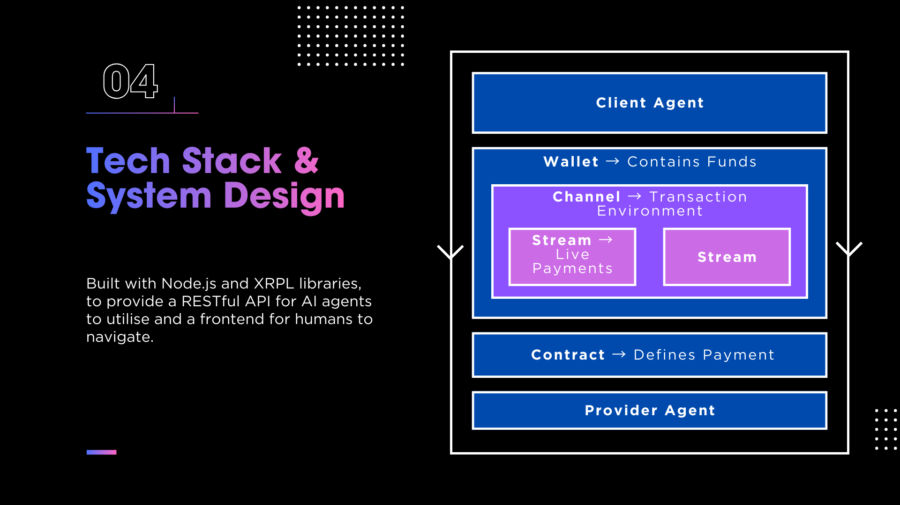

# StreamPay - A debit card for machine-to-machine transactions

This project was built for NUS FinTech Summit 2026. We designed a streaming payment system built on the XRP Ledger (XRPL), with machine-to-machine payments between AI agents in mind. With the proliferation of AI agents being used to automate complex workflows, and common practices of allowing agents to engaging other more specialised agents to complete specific tasks, we believe in the need for an agent-to-agent marketplace (like AI Fiverr) instead of silo-ed away models hosted by individual AI companies.

Traditional payment systems like pre-paid subscriptions or post-paid invoices will not work if there is no guarantee the counterparty agent exists tomorrow. Real-time payments are needed to **build trust as a foundation** for such a marketplace, and StreamPay provides a low-fee solution (compared to bank-issued debit or credit cards).

Our proof-of-concept supports both **XRP Payment Channels** (off-chain streaming) and **RLUSD Direct Payments** (on-chain stablecoin streaming). We built a visual interface for demo purposes, and an API for AI agents to conveniently call.

# How it works


Service provider agents define service contracts for computational tasks like image generation, and make clear material details like cost per second, frequency of streams, etc. Client agents select a service contract, and set up a channel between itself and the provider agent to begin the transaction.

Funds are temporarily escrowed from the client's wallet, and streamed incrementally to the provider at a rate defined by the contract. The client can stop the service any time it wants, and continued payment is taken as proof of satisfactory service.

To prove that services are indeed provided in real time from provider to client, StreamPay helps to hash (with SHA256) specific metrics of work performance from the provider (like cpuCycles or current timestamp) and requires the provider to submit the same information to the client to allow client-side verification.

## Project Structure

```
xrpl-stream/
├── contracts/                    # On-chain XRPL transaction management
│   ├── createChannel.js          # Create XRP payment channels
│   ├── fundChannel.js            # Add funds to existing channels
│   ├── claimChannel.js           # Finalize and close channels
│   └── createRLUSDStream.js      # RLUSD direct payment streaming
├── src/
│   ├── core/                     # Streaming engine
│   │   ├── signer.js             # Off-chain claim signing (sender)
│   │   ├── validator.js          # Claim validation (receiver)
│   │   ├── channelStore.js       # Local state management
│   │   └── contract.js           # Service contracts for M2M
│   ├── api/
│   │   ├── unifiedRoutes.js      # Unified contract-based API
│   │   ├── streamRoutes.js       # XRP streaming API endpoints
│   │   ├── rlusdRoutes.js        # RLUSD streaming API endpoints
│   │   ├── m2mDemoRoutes.js      # M2M demo SSE endpoint
│   │   └── middleware.js         # Auth and validation
│   └── utils/
│       ├── xrplClient.js         # XRPL connection manager
│       └── converters.js         # XRP/drops & USD/cents utilities
├── public/                       # Frontend assets
│   ├── index.html                # Landing page
│   ├── streaming-demo.html       # Main demo UI (XRP + RLUSD)
│   └── m2m-demo.html             # Legacy M2M demo (XRP only)
├── test-scripts/                 # Test and demo scripts
│   ├── 6-m2m-streaming-demo.js   # M2M streaming demo (CLI)
│   ├── full-rlusd-streaming-test.js  # RLUSD API test
│   ├── logic-only-tests.js       # Unit tests (no network)
│   └── ...                       # Other test scripts
├── config.js                     # Configuration constants
├── server.js                     # Application entry point
└── package.json                  # Dependencies
```

## Quick Start

### Prerequisites

- Node.js >= 18.0.0
- npm >= 9.0.0

### Installation

1. **Clone and install:**
```bash
git clone <your-repo-url>
cd xrpl-stream
npm install
```

2. **Set up environment variables:**

Create a `.env` file in the root directory:
```bash
# Network Configuration
XRPL_NETWORK=testnet

# API Configuration
PORT=3000
API_KEY=your-secret-api-key

# Wallet Seeds (TESTNET ONLY - Never use real seeds!)
SENDER_SECRET=sXXXXXXXXXXXXXXXXXXXXXXXXXXXXX
RECEIVER_SECRET=sYYYYYYYYYYYYYYYYYYYYYYYYYYYYY
```

3. **Get Testnet Wallets:**

   **Option A: XRPL Faucet (Recommended)**
   1. Go to [XRPL Testnet Faucet](https://xrpl.org/resources/dev-tools/xrp-faucets)
   2. Click **"Generate Testnet credentials"**
   3. Copy the **Secret** (starts with `s...`) - this is your wallet seed
   4. Repeat to get a second wallet
   5. Paste the first secret as `SENDER_SECRET` and the second as `RECEIVER_SECRET` in your `.env`

   **Option B: Programmatically**
   ```javascript
   const xrpl = require('xrpl');
   const client = new xrpl.Client('wss://s.altnet.rippletest.net:51233');
   await client.connect();
   
   // Generate and fund wallet
   const { wallet } = await client.fundWallet();
   console.log('Address:', wallet.address);
   console.log('Secret:', wallet.seed);  // Use this in .env
   ```

### Running the Server

**Start the server:**
```bash
npm start
```

**Development mode (with auto-reload):**
```bash
npm run dev
```

The server will start at `http://localhost:3000`

### Open the Demo UI

After starting the server, open your browser to:
```
http://localhost:3000
```

This will show the landing page with a link to the **Streaming Demo**, or go directly to:
```
http://localhost:3000/streaming-demo.html
```

## Demo Modes

### XRP Mode (Payment Channels)
- **Mechanism**: Off-chain streaming with on-chain finalization
- **Fees**: Zero fees during streaming, small fee only at finalization
- **Best for**: High-frequency micro-payments, M2M automation
- **Features**: Cryptographic verification, service contracts

### RLUSD Mode (Direct Payments)
- **Mechanism**: On-chain Payment transactions at intervals
- **Fees**: ~0.00001 XRP per payment
- **Best for**: Stable-value payments, commercial settlements
- **Requires**: Trustline to RLUSD issuer on both wallets

## API Endpoints

### Unified API (`/api/unified`) - Recommended
Contract-based streaming with automatic payment execution for both XRP and RLUSD.

| Method | Endpoint | Description |
|--------|----------|-------------|
| POST | `/api/unified/start` | Start stream with auto-execution via contract |
| POST | `/api/unified/stop` | Stop active stream |
| POST | `/api/unified/finalize` | Finalize stream (XRP only) |
| GET | `/api/unified/status/:sessionId` | Get stream status |
| GET | `/api/unified/active` | List all active streams |
| GET | `/api/unified/contracts` | Browse all service contracts |
| GET | `/api/unified/contracts/:id` | Get specific contract |
| POST | `/api/unified/contracts` | Create new contract (providers) |
| PUT | `/api/unified/contracts/:id` | Update contract |
| DELETE | `/api/unified/contracts/:id` | Delete contract |
| GET | `/api/unified/contracts/stats` | Get contract statistics |
| GET | `/api/unified/contracts/categories` | List contract categories |

### XRP Payment Channels (`/api/stream`) - Legacy
| Method | Endpoint | Description |
|--------|----------|-------------|
| POST | `/api/stream/start` | Start streaming session |
| POST | `/api/stream/stop` | Stop streaming session |
| GET | `/api/stream/claim` | Generate signed claim (sender) |
| POST | `/api/stream/validate` | Validate claim (receiver) |
| POST | `/api/stream/finalize` | Finalize claim on-chain |
| GET | `/api/stream/status` | Get channel status |
| GET | `/api/stream/history` | Get claim history |

### RLUSD Streaming (`/api/rlusd`) - Legacy
| Method | Endpoint | Description |
|--------|----------|-------------|
| POST | `/api/rlusd/stream/start` | Start RLUSD stream session |
| POST | `/api/rlusd/stream/payment` | Execute single payment |
| GET | `/api/rlusd/stream/status/:key` | Get session status |
| POST | `/api/rlusd/stream/stop` | Stop RLUSD stream |
| GET | `/api/rlusd/streams/active` | List active sessions |

### M2M Demo (`/api/m2m`)
| Method | Endpoint | Description |
|--------|----------|-------------|
| GET | `/api/m2m/start` | Start M2M demo (SSE stream) |

### System
| Method | Endpoint | Description |
|--------|----------|-------------|
| GET | `/health` | Health check |
| GET | `/api` | API documentation |

## 🧪 Test Scripts

Run individual test scripts:
```bash
# Verify wallet setup
node test-scripts/0-verify-wallets.js

# Create a payment channel
node test-scripts/1-create-channel.js

# Run M2M streaming demo (CLI)
node test-scripts/6-m2m-streaming-demo.js

# Run logic-only tests (no network required)
node test-scripts/logic-only-tests.js
```

## Configuration

Key options in `config.js`:

```javascript
{
  channel: {
    DEFAULT_SETTLE_DELAY: 3600,     // 1 hour
    MIN_CHANNEL_AMOUNT: '1000000',  // 1 XRP minimum
  },
  streaming: {
    DEFAULT_RATE_PER_SECOND: '1000', // 0.001 XRP/sec
    MAX_CLAIMS_PER_MINUTE: 60,
  },
  xrp: {
    symbol: 'XRP',
    decimals: 6,
  },
  currency: {
    currency: 'USD',
    issuer: 'rMxCVaJYp6WDH2mBPk5zLGwxr1g2Ur1qWn', // RLUSD issuer
    symbol: 'RLUSD',
    decimals: 2,
  }
}
```

## Resources

- [XRPL Documentation](https://xrpl.org/)
- [Payment Channels Tutorial](https://xrpl.org/use-payment-channels.html)
- [XRPL Testnet Faucet](https://xrpl.org/resources/dev-tools/xrp-faucets)
- [xrpl.js Library](https://js.xrpl.org/)

## License

MIT
